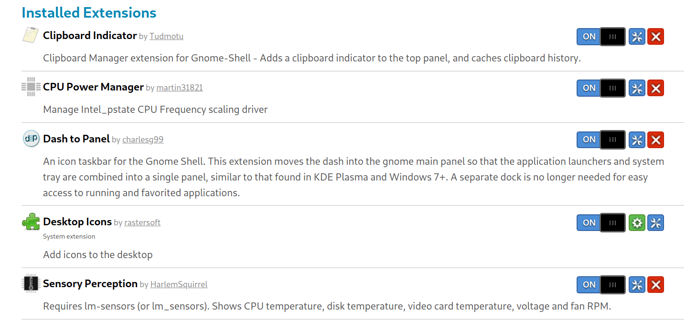

# Linux Setting
Switch to next input source: Alt + Z

Install Dash to Panel

Minimize on click

Launch Terminal: Alt + T

Copy a screenshot of an area to clipboard : Super + Shift + S

Move to Work Space Above / Below : Disabled

Vietnamese: Ibamboo

Turnoff Mouse acceleration

Dim brightness

Gnome-tweaks



# Shell

- Install ZSH

- Install Oh my ZSH

- Install Powerlevel 10k Theme (Remember to install font)

- Install Fzf

- Install Kitty (Terminal):

Add config file (kitty.conf) to ~/.config/kitty/


# Editor
Download nvim.appimage

Put somewhere ( ex: ~/ ), create symbolink in /usr/bin/nvim by:
```
ln -s ~/nvim.appimage /usr/bin/nvim
```

Install Plug:
```
sh -c 'curl -fLo "${XDG_DATA_HOME:-$HOME/.local/share}"/nvim/site/autoload/plug.vim --create-dirs https://raw.githubusercontent.com/junegunn/vim-plug/master/plug.vim' 
```

Create config folder in ~/.config/nvim by: 
```
mkdir -p ~/.config/nvim
```

Copy this **init.vim** to above folder

Run :PlugInstall the first time

Install Language Server
