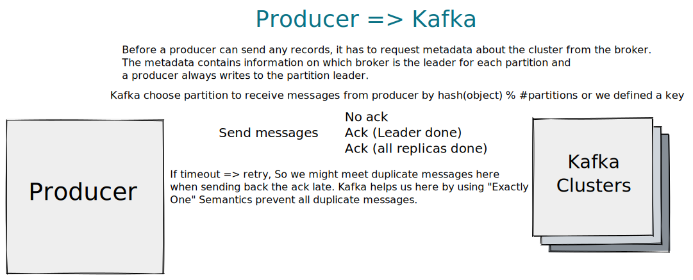

## Kafka

- Kafka is a distributed system consisting of servers and clients that communicate via a high-performance TCP network protocol. It can be deployed on bare-metal hardware, virtual machines, and containers in on-premise as well as cloud environments.

- Kafka is a distributed, horizontally-scalable, fault-tolerant, commit log.

- Kafka's **cluters** contains one or many **brokers**, each broker contains some **partition** of some **topics** (It may have Topic 1 Partition 1, Topic 2 Partition 3, Topic 2 Partition 4 ...). All brokers inside a cluster follow leadership & replication

- A commit log (also referred to as write-ahead log, transaction log) is a persistent ordered data structure which only supports appends. You cannot modify nor delete records from it. It is read from left to right and guarantees item ordering.

	- Kafka actually stores all of its messages to disk and having them ordered in the structure lets it take advantage of sequential disk reads.

    - Reads and writes are a constant time O(1) (knowing the record ID), which compared to other structure’s O(log N) operations on disk is a huge advantage, as each disk seek is expensive.

	- Reads and writes do not affect another. Writing would not lock reading and vice-versa (as opposed to balanced trees)

## Producer

## Consumer
- Kafka follows the principle of a dumb broker and smart consumer. This means that Kafka does not keep track of what records are read by the consumer and delete them but rather stores them a set amount of time (e.g one day) or until some size threshold is met. Consumers themselves poll Kafka for new messages and say what records they want to read. This allows them to increment/decrement the offset they’re at as they wish, thus being able to replay and reprocess events.

- It is worth noting that consumers are actually consumer groups which have one or more consumer processes inside. In order to avoid two processes reading the same message twice, each partition is tied to only one consumer process per group.

- Can config batching in consumers, consider throughput and latency tradeoffs.
