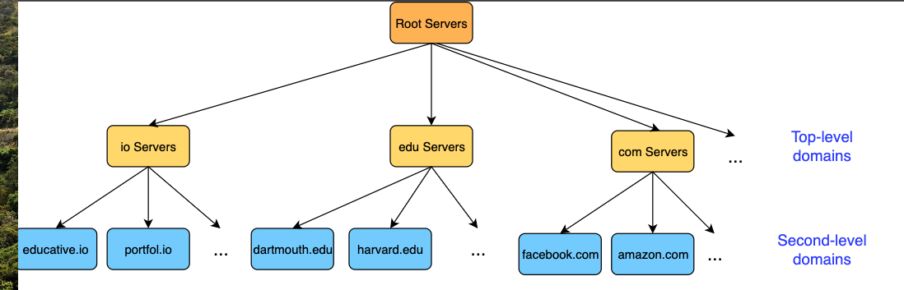

# DNS

## What is DNS?
- At the core, the Internet operates on IP addresses, but these are difficult to remember for humans.
- So, DNS names are preferably used at the application layer for which the DNS provides a mapping to IP addresses.
- For example, HTTP first translates the DNS hostname provided by the user in the URL to its IP address and then attempts to connect to the server.
- Furthermore, DNS is not just a protocol. It also consists of a distributed database of names that map to IP addresses.
- So essentially it’s a directory service.
- DNS uses UDP port 53 to serve DNS query (fast, request is small, fit UDP segment, reliability can be added in app layer by retry)

## DNS Namespaces
- DNS uses Distributed Hierarchical Database
- The parts of the URL above roughly map to DNS servers. These servers manage the abstract space of domains. The servers all exist in a hierarchy.

- Root DNS servers 
  - Are the first point of contact for a DNS query (after the client’s local cache of names and IP addresses). 
  - They exist at the top of the hierarchy and point to the appropriate TLD server in reply to the query. 
  - So a query for educative.io would return the IP address of a server for the top-level domain, io.

- Top-level Servers
  - Servers in the top-level domain hold mappings to DNS servers for certain domains. Each domain is meant to be used by specific organizations only. Here are some common domains:
  - Examples:
    - com: This TLD was initially meant for commercial organizations only - but it has now been opened for general use.
      Example: codinginterview.com
    - edu: Used by educational institutions.
      Example: stanford.edu
    - gov: Only used by the U.S. government.
      Example: nasa.gov

- Authoritative Servers#
  - Every organization with a public website or email server provides DNS records.
  - These records have hostname to IP address mappings stored for that organization.
  - These records can either be stored on a dedicated DNS server for that organization or they can pay for a service provider to store the records on their server.

- Local DNS Cache
  - DNS mappings are often also cached locally on the client end-system to avoid repetitive lookups and saves time for often visited websites.
  - This is done via an entity called the local resolver library, which is part of the OS. The application makes an API call to this library. This library manages the local DNS cache.
  - If the local resolver library does not have a cached answer for the client, it will contact the organization’s local DNS server.
  - This local DNS server is typically configured on the client machine either using a protocol called DHCP or can be configured statically.
  - So, if it’s configured manually, any local DNS server of the client’s choice can be chosen. A few open DNS servers are incredibly popular, such as the ones by Google.

- Local DNS Servers
  - There is one type of server that we ignored — the local DNS Server. 
  - Local DNS servers are usually the first point of contact after a client checks its local cache. 
  - These servers are generally hosted at the ISP and contain some mappings based on what websites users visit.

## Resource Records in Database
- The DNS distributed database consists of entities called RRs, or Resource Records.

- RRs contain some or all of the following values:
  - Name of the domain.
  - Resource data (RDATA) provides information appropriate for the type of resource record.
  - Type of the resource record. We will discuss these shortly.
  - Time-to-live (TTL) is how long the record should be cached by the client in seconds.
  - DNS Class. There a many types of classes but we’re mainly concerned with IN which implies the ‘Internet’ class. That’s what all of our upcoming examples use so we won’t be discussing it again. Another common value for the DNS Class is CH for ‘CHAOS’. The CH class is mostly used for things like querying DNS server versions.

- Types of resource records
  - Address type or A addresses contain IPv4 address to hostname mappings. They consist of:
    - The name is the hostname in question.
    - The TTL in seconds.
    - The type which is A in this case.
    - The RDATA which in this case is the IP address of the domain.
    - Example: educative.io. 299 IN A 104.20.7.183 where educative.io is the name, 299 is the TTL in seconds, IN is the class, A is the type of the RR, and 104.20.7.183 is the RDATA.
  - Canonical name or CNAME records are records of alias hostnames against actual hostnames. For example if, ibm.com is really servereast.backup2.com, then the latter is the canonical name of ibm.com.
    - The name is the alias name for the real or ‘canonical’ name of the server.
    - The RDATA is the canonical name of the server.
    - Example: bar.example.com. CNAME foo.example.com.
  - Mail Exchanger or MX records are records of the server that accepts email on behalf of a certain domain. We have seen this one before!
    - The name is the name of the host.
    - The RDATA is the name of the mail server associated with the host.
    - Example: educative.io IN MX 10 aspmx2.googlemail.com.
    - These resource records are stored in text form in special files called zone files.

