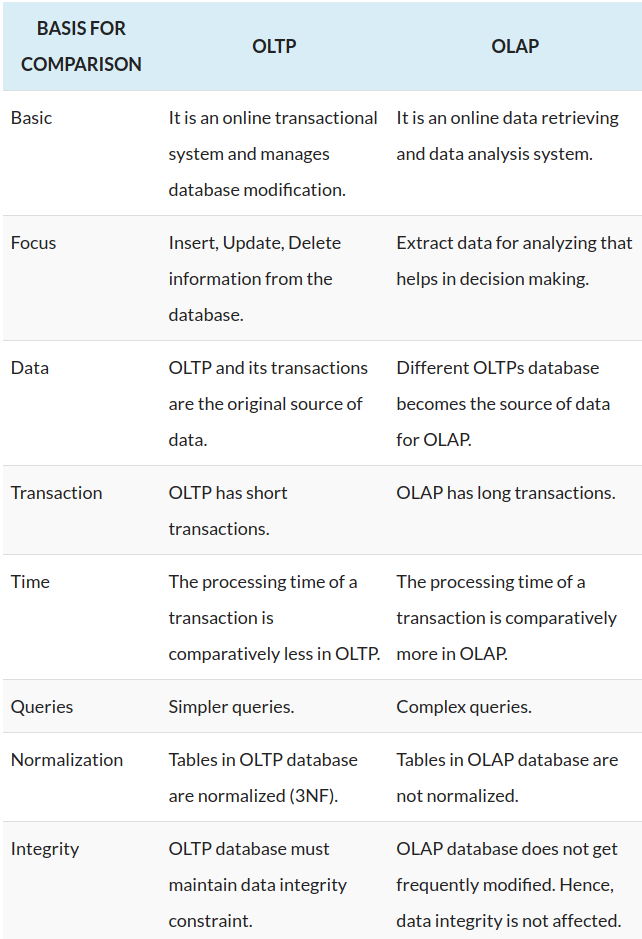

OLTP and OLAP both are the online processing systems.
OLTP is a transactional processing while OLAP is an analytical processing system

TLDR:  
OLTP for day-to-day queries  
OLAP (put databases => datawarehouse) analyze data 