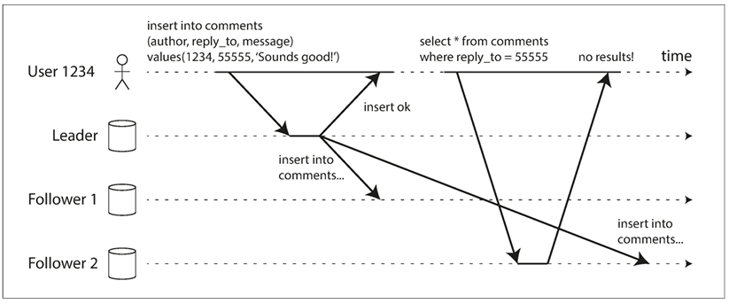
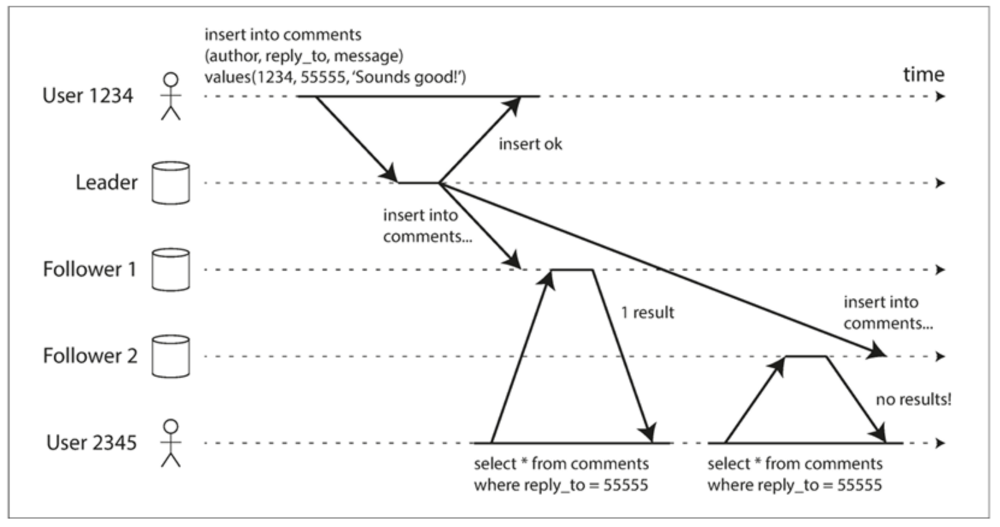
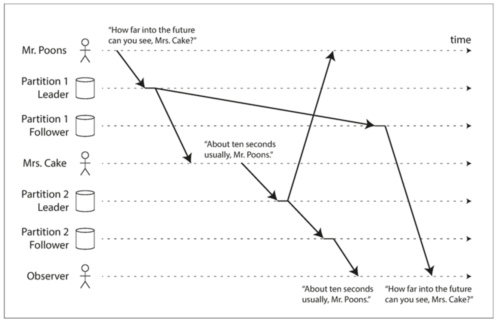

# Replication

## Implementation of Replication Logs

1. Statement based replication (Old MySQL)
  - Logs every write request (INSERT, UPDATE, DELETE) and foward to followers.
  - Downside: NOW(), must be same order execution on each replica, side effects...
2. Write-ahead log (WAL) shipping (PostgresQL)
  - Append-only sequence of bytes containing all writes to database.
  - Downside: describe data on very low level (contains details of which bytes were changed in which disk blocks)) => Tightly couple to storage engine
3. Logical (row-based) log replication (MySQL)
  - In RDB, is usually a sequence of records describing writes to database tables at the granularity of a row
  - Decoupled from the storage engine internals.
4. Trigger-based replication
  - Flexibility, only replicate a subset of the data, replicate from one kind of db to another, conflict resolution logic
  - Prone to bugs and limitations than the database's builtin replication.

## Replication Lag

1. Reading your own writes
  - 
  - In this situation, we need  read-after-write consistency, also known as  read-your-writes consistency . This is a guarantee that if the user reloads the page, they will always see any updates they submitted themselves
  - Some various possbile techniques:
    - When reading something that the user may have modified, read it from the leader; otherwise, read it from a follower. This requires that you have some way of knowing whether something might have been modified, without actually querying it. For example, user profile information on a social network is normally only editable by the owner of the profile, not by anybody else. Thus, a simple rule is: always read the user’s own profile from the leader, and any other users’ profiles from a follower.
    - If most things in the application are potentially editable by the user, that approach won’t be effective, as most things would have to be read from the leader (negating the benefit of read scaling). In that case, other criteria may be used to decide whether to read from the leader. For example, you could track the time of the last update and, for one minute after the last update, make all reads from the leader. You could also monitor the replication lag on followers and prevent queries on any follower that is more than one minute behind the leader.
    - The client can remember the timestamp of its most recent write—then the system can ensure that the replica serving any reads for that user reflects updates at least until that timestamp. If a replica is not sufficiently up to date, either the read can be handled by another replica or the query can wait until the replica has caught up. The timestamp could be a logical timestamp (something that indicates ordering of writes, such as the log sequence number) or the actual system clock. 
    - If your replicas are distributed across multiple datacenters (for geographical proximity to users or for availability), there is additional complexity. Any request that needs to be served by the leader must be routed to the datacenter that contains the leader.

2. Monotonic reads
  - 
  - Monotonic reads  [23] is a guarantee that this kind of anomaly does not happen. It’s a lesser guarantee than strong consistency, but a stronger guarantee than eventual consistency. When you read data, you may see an old value; monotonic reads only means that if one user makes several reads in sequence, they will not see time go backward— i.e., they will not read older data after having previously read newer data. 
  - One way of achieving monotonic reads is to make sure that each user always makes their reads from the same replica (different users can read from different replicas). For example, the replica can be chosen based on a hash of the user ID, rather than randomly. However, if that replica fails, the user’s queries will need to be rerouted to another replica

3. Consistent prefix reads
  - 
  - If some partitions are replicated slower than others, an observer may see the answer before they see the question
  - Preventing this kind of anomaly requires another type of guarantee:  consistent prefix reads . This guarantee says that if a sequence of writes happens in a certain order, then anyone reading those writes will see them appear in the same order. This is a particular problem in partitioned (sharded) databases
  - One solution is to make sure that any writes that are causally related to each other are written to the same partition—but in some applications that cannot be done efficiently